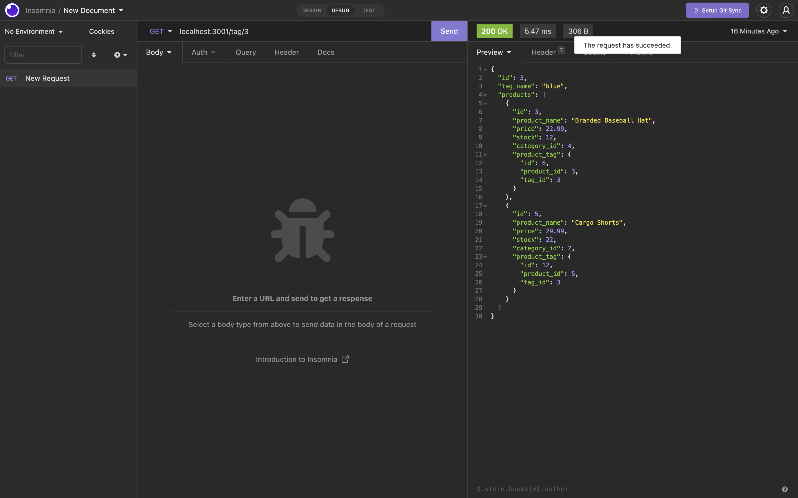
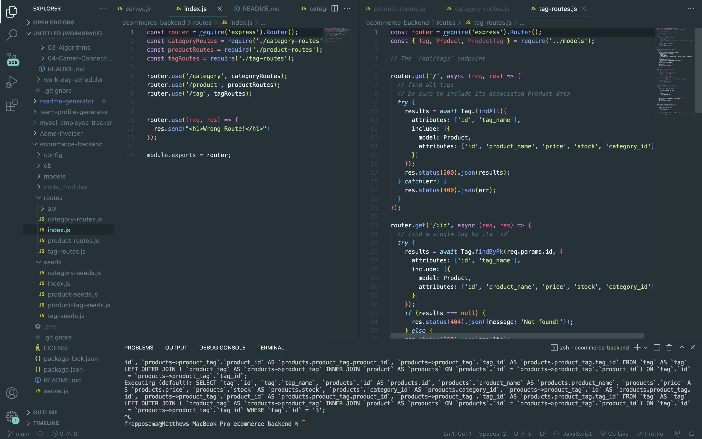

# E-Commerce Back End

## Description

 This app is the backend portion of an E-Commerce website. Express.js was used for the server and MySQL for the database along with Sequelize as the ORM to run SQL models and queries. The SQL database includes tables for products, categories, tags, and product tags. RESTful API routes are used to make requests and updates from the database which are joined through Sequelize queries.

## Installation

- Both Node.js and MySQL must be installed on your computer.

- Navigate to the root directory and run:
npm install.

- To start the server, in the command line run:
npm start.

## Tech Used

- Node
- Express
- MySQL
- Sequelize

## License

## Screenshots

## Links
https://youtu.be/S_kNE-SQob4

## Contributing

Matthew Gonzales

## Username

@mattyjtx

## Email

mattgonzales3@yahoo.com